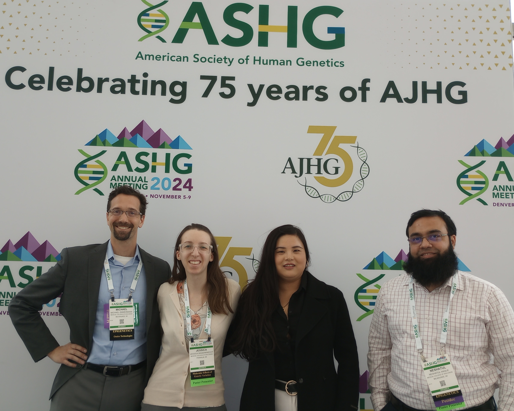

# Computational-Structural-Genomics

Out lab’s <b>Mission</b> is to develop the scientific, knowledge representation, and communication approaches, that will empower <strong>Next-Gen Genomics Interpretation</strong>.
<ul>
  <li>Our <b>Premise</b> is that <em>Genomics + Physics + Data Science + Cell Biology + Biochemistry + Biophysics > Genomics</em>. Said another way, that translating basic and computational sciences into genomics will add new data to enhance information and develop new knowledge.</li>
  <li>Our <b>Vision</b> is, <i>Your Genome, Interpreted</i>.</li>
  <li>Interpreting genomics data using structural bioinformatics, structural and functional genomics, and integrative data science.</li>
  <li>Advanced computational modeling of genetic mutations that drive cancer and define genetic diseases, to identify molecular causes and towards mutation-specific druggability.</li>
  <li>Defining new genetic diseases by identifying underlying molecular mechanisms of heritable syndromes.</li>
</ul>

### Publications
Our Team's publications on PubMed: <a href="https://pubmed.ncbi.nlm.nih.gov/?term=%22zimmermann+mt%22%5Bau%5D+AND+%28%22Iowa+State+University%22%5Bad%5D+OR+%22mayo+clinic%22%5Bad%5D+OR+%22Medical+college+of+Wisconsin%22%5Bad%5D%29&sort=date">Search Link<a>

### Where we Work
We are part of the <a href="https://www.mcw.edu/departments/genomic-sciences-and-precision-medicine-center-gspmc">Mellowes Center</a> at <a href="https://www.mcw.edu/">MCW</a>. Our Mellowes Center brings together people and technology to go <b><i>Beyond the Base Pairs</i></b> and interpret the effects of the genetic differences that we call carry within us.

### What We Do
We are grateful to NIGMS, the Mellowes family, and the Advancing a Healthier Wisconsin (AHW) endowment fund for their support. AHW made a summary when our first round of funding finishing. Check out <a href="https://blog.ahwendowment.org/wisconsins_first_cancer_precision_simulation_unit">this blog post</a>. There is a 4 min produced video at the end with an interview among myself, Dr. Urrutia, and the team.

Also, <a href="https://youtu.be/8JUbqJDFVKc">this summary video</a> is a great high-level overview of our efforts in rare and undiagnosed genetic diseases, from the perspective of our Mellowes Center annual scientific symposium.

Explore some of the tools, processes, and resources developed by our team below!
- P2T2
  - <i>A public tool for rapid assessment of a protein and genetic variants in the protein.</i>
  - <a href="https://p2t2.ctsi.mcw.edu/frontend/">Try it out</a>, or, <a href ="https://pubmed.ncbi.nlm.nih.gov/34377961/">read more about it</a>
- RITAN
  - <i>Rapid integration of term annotation and network resources. An open-sourced R package enabling geneset annotation of gene ontology, biological pathways, network biology, and more information.</i>
  - <a href ="https://www.bioconductor.org/packages/release/bioc/html/RITAN.html">Try it out</a>, or, <a href="https://pubmed.ncbi.nlm.nih.gov/31355053/">read more about it</a>
- Structural Biology Workflow
  - <i>A comprehensive process to analyze patient variants, which collects comparator variants, annotates variants with known pathogenicity, phenotype, and allele frequency information, and scores the impact of the variants on the protein structure and dynamics.</i>
  - This workflow has been set up for both R and Discovery Studio Platforms internally
  - Many of our papers have utilized our workflow, including <a href="https://doi.org/10.1016/j.thromres.2020.07.014">Biallelic variants in PROZ as a cause of hypercoagulability and livedo racemosa</a>, <a href="https://doi.org/10.1016/j.csbj.2021.12.007">Enhanced interpretation of 935 hotspot and non-hotspot RAS variants using evidence-based structural bioinformatics</a>, <a href="https://doi.org/10.1016/j.csbj.2022.04.028">Structural bioinformatics enhances the interpretation of somatic mutations in KDM6A found in human cancers</a>, <a href="https://doi.org/10.1016/j.clim.2023.109692">Advanced computational analysis of CD40LG variants in atypical X-linked hyper-IgM syndrome</a>, <a href="https://doi.org/10.1016/j.ajhg.2024.09.006">MARK2 variants cause autism spectrum disorder via the downregulation of WNT/β-catenin signaling pathway</a>, and <a href="https://doi.org/10.1097/hep.0000000000001249">Discovery of a MET-driven monogenic cause of steatotic liver disease</a>
  - <b>Within our workflow, we also have specialized modules for domain analysis, including Kinase and GTPase domains</b>
- MD Analysis Workflow
  - <i>A streamlined workflow to analyze and summarize molecular dynamics data, producing graphs of various metrics for each variant as well as comparing all variants.</i>
  - Much of our research is aided by this workflow, including some recently published papers: <a href="https://pubmed.ncbi.nlm.nih.gov/37841325/">Beyond structural bioinformatics for genomics with dynamics characterization of an expanded KRAS mutational landscape</a> and <a href="https://doi.org/10.3390/life14030297">Structural and Dynamic Analyses of Pathogenic Variants in PIK3R1 Reveal a Shared Mechanism Associated among Cancer, Undergrowth, and Overgrowth Syndromes</a>
- RAG Activity Prediction MLM
  - <i>Predicts the effect of genetic variants on RAG activity, utilizing a machine learning model trained on <i>in vitro</i> enzymatic testing of 346 variants.</i> 
  - <a href="https://github.com/neshatul/RAGactivityPred/">Try it out</a>, or, <a href="https://pubmed.ncbi.nlm.nih.gov/37854700/">read our full study</a>
- Surface Scores
  - <i>A standardized process to score changes in protein surface properties, especially solubility and electrostatic distribution, which informs analysis of protein function and functional impact of variants.</i>
  - <a href="https://pubmed.ncbi.nlm.nih.gov/39596086/">Read more about this tool here!</a>
- Paralog Annotation Analysis
  - <i>Generates a report detailing the paralogs of your gene of interest, the conservation of residues adjacent to your residues of interest, and any annotations of those paralogs’ residues, including pathogenicity and associated phenotypes.</i>

## Meet Our Amazing Team!

Everyone in our team was thrilled to present their work at the 2024 American Society of Human Genetics Conference in Denver, Colorado! To meet our team, <b><a href="team.html">click here</a></b>
